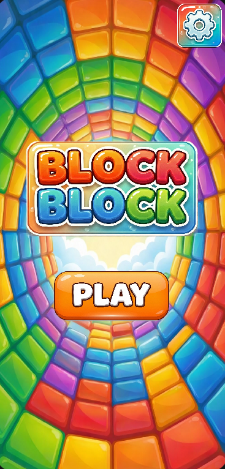
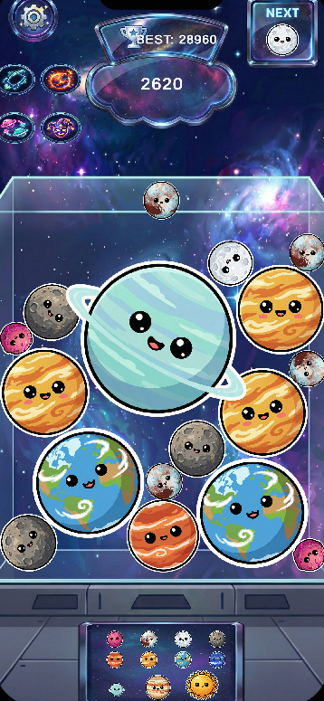

### 👋 Hi there, I'm Bünyamin Kerim Yılmaz!
**Game Developer | Unity | C#**

I am a passionate Game Developer focused on creating immersive gameplay experiences with Unity. Here you can find my latest projects and what I'm currently working on.

---

### 🏆 My Portfolio

| **🚚 Trade Truck** | **🧱 BlockBlock** | **🪐 PlanetMerge** |
|:---:|:---:|:---:|
|  |  |  |
| A survival-trading simulation set in a zombie apocalypse. Manage your mobile shop, trade resources, and survive in a hostile world. | A classic block puzzle game. Strategically fit blocks into the grid to clear lines and achieve high scores. | A physics-based merge puzzle. Drop planets from the top and combine identical ones to evolve them into massive celestial bodies. |
| [View on GitHub](https://github.com/Bunyaminkerimyilmaz/TradeTruck) | [View on GitHub](https://github.com/Bunyaminkerimyilmaz/BLOCKBLOCK)   [📲 Google Play](https://play.google.com/store/apps/details?id=com.krox.block) | [View on GitHub](https://github.com/yavuzadali34/SpaceMerge) |

---

### 🛠️ Tech Stack & Tools

---
📫 **Connect with Me:** [LinkedIn Profile](https://www.linkedin.com/in/bunyamin-kerim/) | [Email Me](mailto:bunyaminkerimyilmaz6@gmail.com)
